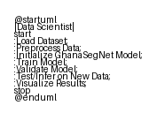

# Chapter 3 — Methodology

<!-- Rendered pipeline diagram -->

*Figure 3.A: Overall segmentation pipeline workflow.*

This chapter describes the full methodology used to develop, train, and evaluate GhanaSegNet. It specifies the experimental contract, the proposed multi-stage training strategy, model design, loss functions, training protocol, data processing, reproducibility practices, and ethical considerations. The goal is to provide a clear, reproducible recipe so readers can reproduce the reported experiments or adapt the pipeline to related tasks.

## 3.1 Overview

This work frames the semantic segmentation task as a per-pixel multi-class classification problem. Inputs are RGB images X ∈ R^{H×W×3} and targets are integer masks Y ∈ {0, ..., C-1}^{H×W} where C = 6 for the FRANI dataset used in this thesis. The primary evaluation metric is mean Intersection over Union (mIoU) computed on the held-out validation split.

Contract (inputs / outputs / success criteria):
- Inputs: batched RGB images (B, 3, H, W) and corresponding ground-truth masks (B, H, W).
- Outputs: per-pixel logits L ∈ R^{B×C×H×W}, softmax probabilities P, and predicted masks Ŷ = argmax_c P.
- Artifacts: model checkpoint files, run metadata JSON (hyperparameters, seed, timestamps), and per-epoch metrics (CSV/JSON).
- Success criteria: reproducible baseline runs report validation mIoU ≈ 0.2437 for the configurations used in this thesis; improvements are evaluated relative to this baseline using the same evaluation protocol.

High-level pipeline (end-to-end):
1. Data ingestion and validation → 2. Preprocessing & augmentation → 3. Model initialization (transfer learning) → 4. Training with combined loss → 5. Evaluation and analysis (quantitative + qualitative) → 6. Checkpointing and artifact archival.

Common failure modes and mitigations:
- Mask encoding mismatches (palette vs class ids): validate masks at load time and convert palettes to integer class ids.
- Shape or channel mismatches: assert input shapes and channel counts in the dataset loader.
- Non-reproducibility due to RNG or nondeterministic ops: fix seeds, document environment, and provide `--benchmark-mode` to favor determinism where applicable.

Figure / table placeholders to include in the thesis:
- Figure 3.1: Pipeline diagram (data → pretraining → model → training → evaluation).
- Figure 3.2: GhanaSegNet architecture schematic (encoder, transformer bottleneck, decoder).
- Table 3.1: Primary run hyperparameters and tensor shapes (refer to `scripts/train_baselines.py`).

## 3.2 Proposed Methodology

This section details the specific choices made in data handling, network architecture, loss formulation, training schedule, and evaluation used to produce the results reported in this thesis.

### 3.2.1 Data & Preprocessing

<!-- Rendered data preprocessing diagram -->

*Figure 3.B: Data preprocessing steps for segmentation.*

Dataset: FRANI (1,141 labelled images; split used in experiments: 939 train / 202 validation). The dataset contains six semantic classes representative of common Ghanaian dishes and accompanying components.

Preprocessing steps:
- Validate filename correspondence between images and masks.
- Standardize image sizes using progressive resizing (base training at 256×256, fine-tuning at 320×320 and 384×384 where feasible).
- Normalize images to ImageNet mean and standard deviation for transfer learning compatibility.
- Verify mask pixel values fall within [0, C−1] and convert palettes to class ids when necessary.

Augmentation strategy (online, Albumentations): random flips and rotations, color jitter, random crops, elastic and perspective transforms, Gaussian blur and noise, brightness/contrast adjustments. Augmentations are tuned to simulate natural presentation variability (plating, lighting, occlusion) without creating unrealistic samples.

Class balancing:
- Use Generalized Dice weighting or sample re-balancing for rare classes. For some experiments we oversample images containing under-represented classes to stabilize gradients.

### 3.2.2 Multi-stage Transfer Learning

Rationale: progressively reduce domain gap from generic visual patterns to culturally specific food presentation.

Stages:
- Stage 0 — ImageNet pretraining: initialize encoder weights from ImageNet-pretrained backbones (EfficientNet variants via `timm` or `efficientnet-pytorch`).
- Stage 1 — Food-domain finetuning: optionally finetune on large food datasets (Food101, Nutrition5k) to learn dish-level textures and color distributions.
- Stage 2 — Regional adaptation: train on African cuisine proxies and synthetic composite examples to reduce cultural domain shift.
- Stage 3 — FRANI specialization: final fine-tuning on FRANI with staged unfreezing and reduced learning rates.

Practical recipe:
- Use lower learning rates for encoder parameters (e.g., lr_encoder = 0.1 × lr_head).
- Freeze encoder initially and train decoder/head for N epochs (empirically N ∈ [3, 10]) then progressively unfreeze earlier blocks.
- Save stage-specific run metadata for ablation studies.

### 3.2.3 Model Architecture — GhanaSegNet

<!-- Rendered model architecture diagram -->

*Figure 3.C: GhanaSegNet model architecture.*

Design goals: achieve accurate boundary delineation and robust class discrimination while keeping the model compact for practical deployment.

Key components:
- Encoder: EfficientNet-derived multi-scale feature extractor producing maps F_1...F_4.
- Transformer bottleneck: lightweight transformer blocks operating on a reduced-channel bottleneck to inject global context with modest compute/memory overhead.
- Decoder: food-aware decoder with learnable skip adapters, channel attention, and progressive upsampling to output logits at the original resolution.

Implementation notes:
- The bottleneck reduces channel dimensionality via 1×1 convolutions prior to transformer layers to limit token counts.
- See `models/ghanasegnet.py` for the code-level implementation used in experiments.

### 3.2.4 Loss Function

<!-- Rendered loss & metrics diagram -->

*Figure 3.D: Loss and metrics calculation process.*

Composite objective used in experiments:
L = α · L_Dice + β · L_Boundary + γ · L_Focal

- L_Dice / L_GeneralizedDice: mitigates class imbalance by emphasizing overlap.
- L_Boundary: encourages precise boundaries using morphological gradients or distance transforms of ground-truth masks.
- L_Focal: optional term to emphasize hard pixels (useful when false negatives dominate).

Typical weights in reported runs: α = 0.6, β = 0.4, γ = 0.0 (adjusted depending on experiments).

### 3.2.5 Training Protocol

<!-- Rendered training sequence diagram -->

*Figure 3.E: Training and evaluation workflow.*

Optimizer & scheduling:
- AdamW optimizer with weight decay 1e-4.
- Learning-rate scheduling: cosine annealing (optionally with warm restarts) or ReduceLROnPlateau when runs are short.

Stability & performance:
- Mixed-precision (AMP) is used when available to accelerate training. When deterministic exactness is required we disable nondeterministic ops and set seeds.
- Gradient clipping (max-norm = 1.0) is applied to stabilize training of transformer components.

Hyperparameters used in reported experiments:
- Batch size: 8
- Base learning rate: 1e-4 (encoder-scaled as above)
- Weight decay: 1e-4
- Epochs: up to 100 with early stopping (patience = 10)

Checkpointing & artifacts:
- Save the best checkpoint (by validation mIoU) and a run JSON containing hyperparameters, seed, timestamp, and per-epoch metrics.

### 3.2.6 Evaluation & Analysis

<!-- Rendered experiment setup diagram -->

*Figure 3.F: Experimental setup and comparison workflow.*

Metrics:
- Primary: mean Intersection over Union (mIoU) on validation set.
- Secondary: pixel accuracy, per-class IoU, Dice coefficient, and boundary F1 score.

Quantitative + qualitative workflow:
- Automated scripts produce per-epoch CSV/JSON metrics, training/validation curves, and model comparison tables.
- Qualitative image grids (input, ground truth, model prediction) are generated for representative samples to provide visual evidence for strengths and failure modes.

Confidence & statistical reporting:
- Where multiple runs are available, report mean ± std and 95% confidence intervals for core metrics (boxplots and t-tests in analysis notebooks).

### 3.2.7 Implementation & Reproducibility

Code organization and entry points:
- Models: `models/ghanasegnet.py`, `models/unet.py`, `models/deeplabv3plus.py`, `models/segformer.py`.
- Training and evaluation: `scripts/train_baselines.py`, `scripts/evaluate.py`, `scripts/test.py`.
- Utilities: `utils/losses.py`, `utils/metrics.py`, `infrastructure/data/*` for datasets and augmentations.

Reproducible environment:
- Use `requirements.txt` to create a virtual environment. A sample PowerShell setup is provided in Chapter 4.
- For exact reproducibility, enable `--benchmark-mode` and set seeds (documented in `scripts/train_baselines.py`).

Expected artifacts after a run:
- `checkpoints/<model>/run_<timestamp>_config.json`
- `checkpoints/<model>/best_model.pth`
- `checkpoints/<model>/metrics.csv` or `run_summary.json`

### 3.2.8 Ethical considerations

| Source | Consent | Annotation Process |
|--------|---------|-------------------|
| FRANI  | Yes     | Nutritionist + Local Expert |

Data governance and consent:
- Use images with documented consent or permissive licenses. Remove sensitive personal data and faces if consent is missing.
- Maintain provenance metadata (source, annotator, consent) in dataset manifests.

Bias mitigation and cultural validation:
- Evaluate per-class and presentation-style performance to detect systematic failures.
- Engage with domain experts (nutritionists and local food experts) to validate labels and deployment requirements.

Deployment cautions:
- For nutritional or clinical applications, conduct local validation studies and obtain ethical approvals.
- Implement human-in-the-loop safeguards: low-confidence cases should be flagged for manual review.

## 3.3 Chapter summary

This chapter presented a reproducible methodology for GhanaSegNet: a staged transfer learning pipeline, a compact hybrid CNN–Transformer architecture, a boundary-focused composite loss, and a rigorous training and evaluation protocol. The code and notebooks included in the repository provide the concrete artifacts needed to reproduce the reported experiments and to extend them in future work.

