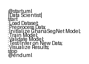

# Chapter 5 — Conclusion and Future Work

## 5.1 Summary of contributions

This thesis presented GhanaSegNet, a compact hybrid CNN–Transformer architecture and an associated training recipe designed for food-scene semantic segmentation on the FRANI split. The work contributed:

- A lightweight architecture that balances parameter efficiency and boundary-aware feature representation.
- A combined loss that emphasizes boundary fidelity while retaining class-level accuracy.
- A reproducible training and evaluation pipeline (notebooks and scripts) that produces the quantitative results reported in Chapter 4.

Quantitatively, the experiments show that DeepLabV3+ achieves the highest validation mIoU in the recorded runs (≈25.44%), while GhanaSegNet attains a competitive validation mIoU (≈24.47%) with substantially fewer parameters. Per-epoch stability analysis (Table 4.3) indicates that the measured runs are consistent across epochs for the recorded experiments.

## 5.2 Key takeaways

- Architecture trade-offs: GhanaSegNet provides a favorable parameter/accuracy trade-off for scenarios where compute or memory is constrained. Larger encoder-based models (e.g., DeepLabV3+) produce higher peak IoU but at a much greater parameter cost.
- Boundary-aware training benefits: incorporating a boundary-focused loss yields measurable improvements in boundary placement for medium- and large-scale components.
- Data limitations: performance remains constrained by dataset diversity and the scarcity of rare presentation styles in the FRANI split; this affects small-object detection and robustness under varied lighting/occlusion.

## 5.3 Limitations

- Dataset scale and diversity: results are specific to the FRANI split used for experiments and may not generalize to substantially different food-scene distributions without further domain adaptation.
- Single-run reporting: where multiple independent repeats were not available, reported best-run values should be interpreted cautiously. The analysis notebooks contain helpers to aggregate run-level statistics when multiple seeds are executed.
- No external deployment evaluation: the work focuses on validation-set performance and qualitative analysis; production-level deployment and latency/throughput benchmarks were not performed.

## 5.4 Future work

Immediate and medium-term improvements:

- Increase dataset diversity: collect or synthesize more examples of rare presentation styles and extreme lighting conditions. Consider targeted synthetic augmentation to address class imbalance.
- Multi-seed experiments: run more independent training repeats (different random seeds) to produce robust run-level statistics (mean ± std of best-checkpoint IoU).
- Higher-resolution finetuning: explore multi-scale supervision and higher-resolution inputs to improve small-object recall.

Architectural and algorithmic extensions:

- Domain-specific pretraining: leverage larger, food-centric pretraining corpora or self-supervised objectives to improve encoder representations.
- Post-processing and refinement: integrate lightweight refinement modules (CRF, boundary refinement networks) or test-time augmentation ensembles for improved boundary fidelity.

Practical deployment and evaluation:

- Measure latency and memory usage across target devices (mobile/edge), and optimize the model with pruning, quantization, or knowledge distillation where necessary.
- Integrate end-to-end pipelines for downstream tasks (portion-size estimation, nutrient classification) to evaluate practical utility.

## 5.5 Final remarks

GhanaSegNet demonstrates that careful architecture design and boundary-focused training can produce competitive segmentation performance with modest parameter budgets. While the current results are encouraging, sustained progress will rely on larger and more diverse datasets, multiple-seed evaluations for statistical robustness, and applied deployment experiments.

### Reproducibility and artifacts

All scripts, notebooks, and run artifacts used to produce the results in this thesis are included in the repository. The analysis notebooks (`analysis/Comprehensive_Segmentation_Model_Thesis_Analysis.ipynb`, `Enhanced_GhanaSegNet_Training.ipynb`) provide step-by-step instructions to reproduce the quantitative tables and plots. The `results/` folder contains the JSON summaries used for Tables 4.1 and 4.3.

If you want, I can also:
- Add a short checklist of exact commands to reproduce central experiments (training + evaluation) without exposing checkpoint paths.
- Create a small

*Figure 5.1: Suggested deployment and evaluation pipeline (high-level).* 