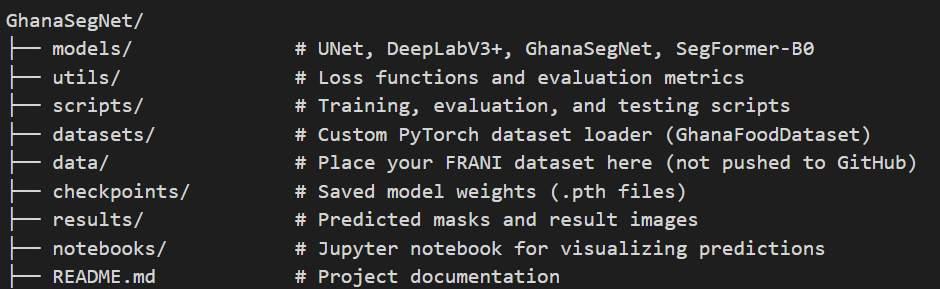

# GhanaSegNet: A Novel CNN-Transformer Hybrid for Ghana Food Segmentation

[](https://www.python.org/downloads/)
[](https://pytorch.org/)
[](https://opensource.org/licenses/MIT)

**GhanaSegNet** is a novel deep learning architecture that combines CNN and Transformer approaches for semantic segmentation of traditional Ghanaian foods. This research project introduces a food-aware loss function and provides comprehensive benchmarking against state-of-the-art baseline models.

## 🏆 Key Contributions

- **Novel Architecture**: CNN-Transformer hybrid with EfficientNet-B0 encoder and U-Net decoder
- **Food-Aware Loss**: Combined Dice + Boundary loss optimized for food segmentation
- **Comprehensive Benchmarking**: Against UNet, DeepLabV3+, and SegFormer-B0
- **Reproducible Pipeline**: Complete training and evaluation framework

## 🏗️ Architecture Overview

GhanaSegNet integrates:
- **Encoder**: EfficientNet-B0 for efficient feature extraction
- **Bottleneck**: Transformer layers for global attention
- **Decoder**: U-Net style with skip connections
- **Loss Function**: 80% Dice Loss + 20% Boundary Loss

---

## 📁 Project Structure



## 🔧 Requirements

- Python 3.8+
- PyTorch ≥ 1.13
- torchvision
- matplotlib
- numpy
- scikit-learn
- Pillow

Install all dependencies using:

```bash
pip install -r requirements.txt

You may create this file manually or install packages as needed.

📦 Dataset Setup
Download the FRANI dataset (pixel-annotated Ghanaian food images) and organize it like this:

bash
Copy code
data/frani/
├── train/
│   ├── images/
│   └── masks/
├── val/
│   ├── images/
│   └── masks/
└── test/
    ├── images/
    └── masks/
Images: RGB format (e.g. .jpg, .png)

Masks: Grayscale with class IDs as pixel values

Make sure filenames match between images/ and masks/.

🚀 How to Train
Train any model (e.g., GhanaSegNet) using:

bash
Copy code
python scripts/train.py
Saves best model to checkpoints/best_model.pth

Automatically evaluates on the validation set

📊 How to Evaluate
Evaluate trained models on the test set:

bash
Copy code
python scripts/evaluate.py
Computes: Mean IoU, Accuracy, Per-class F1

Saves visual predictions to results/

🧪 Inference: Predict on a Single Image
bash
Copy code
python scripts/test.py
Modify image_path in the script

The predicted mask is saved to results/test_prediction.png

📈 Visualize Results
Use the Jupyter notebook to visually compare:

bash
Copy code
notebooks/results_visualization.ipynb
Original image

Ground truth mask

Predicted mask

📚 Citation
If you use GhanaSegNet in your research or thesis, please cite the original repository or acknowledge the contribution in your documentation.

🙌 Acknowledgements
FRANI Dataset Team

PyTorch Open Source Community

Authors of UNet, DeepLabV3+, SegFormer

Made with ❤️ for food segmentation research in Ghana.


